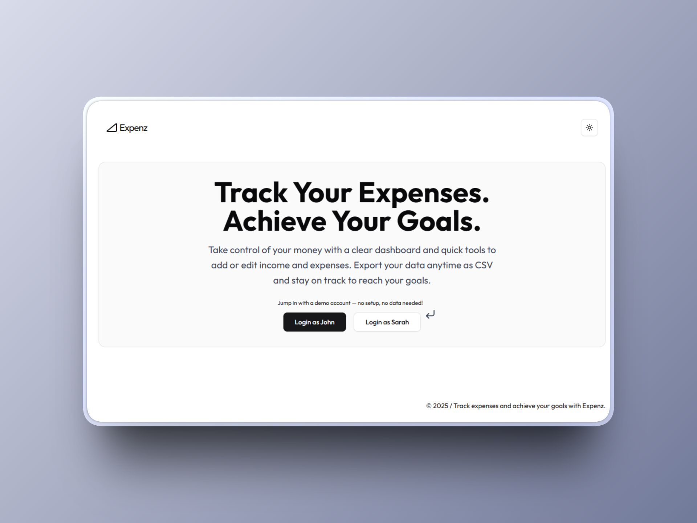

# Expenz - Expense Tracker Dashboard


Expenz is a web application designed to help users track, analyze, and understand their financial activity with ease.
It provides an intuitive dashboard showcasing income, expenses, budget and insight through an interactive chart.
Two built-in demo accounts allow users to explore the full experience instantly—no signup or data entry required.
A dedicated FastAPI service powers CSV export functionality for income and expense records.


## Table of Contents

- [Preview](#preview)
- [Features](#features)
- [Tech Stack](#tech-stack)
- [Running Locally](#running-locally)
- [Demo](#demo)
- [Contributions](#contributions)
- [License](#license)

# Preview

<p align="center">
  
  
</p>

# Features

- **Instant Demo Access** — Log in with one of two demo accounts to explore the dashboard immediately.

- **Comprehensive Dashboard** — View total income, expenses, and budget summaries with dynamic data visualization.

- **Detailed Views** — Browse categorized income and expense entries.

- **CSV Export** — Export income and expense data directly via a FastAPI-powered backend.

- **Responsive Design** — Optimized for both desktop and mobile devices.

- **Smooth Loading Experience** — Skeleton loading states ensure a polished and fluid UX.

# Tech Stack

### Frontend

- `Next.js`
- `React`
- `shadcn/ui`
- `lucide-react`
- `framer-motion`
- `tailwindcss`
- `recharts`
- `zod`

### Backend

- `Neon Database`(PostgreSQL)

### CSV Export Service (Python API)

- `FastAPI`
- `uvicorn`

# Running Locally

1. **Clone the repository:**

   ```bash

   git clone https://github.com/dnmore/expenz-dashboard.git
   cd expenz-dashboard

   ```

2. **Install dependencies**
   **Frontend**

   ```bash

     cd frontend
     pnpm install

   ```

   **Python Backend (CSV Export)**

   ```bash

     cd services/csv-export
     pip install -r requirements.txt

   ```

3. **Set up environment variables**

- Create `.env` files in the project root for both the frontend and backend, and define necessary variables (e.g., database connection string, API keys).

4. **Run the application**

**Start the frontend**

```bash

 cd frontend
 pnpm run dev

```

**Start the Python Backend**

```bash

 cd service/csv-export
 uvicorn api.main:app --reload

```

5. **Access the application**

Once both servers are running, open your browser and visit: `http://localhost:3000`.

# Demo

[Live Demo](https://expenz-tracker-dashboard.vercel.app/)

# Contributions

Contributions are welcome!

1. Fork the repository.
2. Create a new branch (`feature/your-feature-name`).
3. Commit changes with clear messages.
4. Submit a pull request.

# License

This project is licensed under the MIT License.
